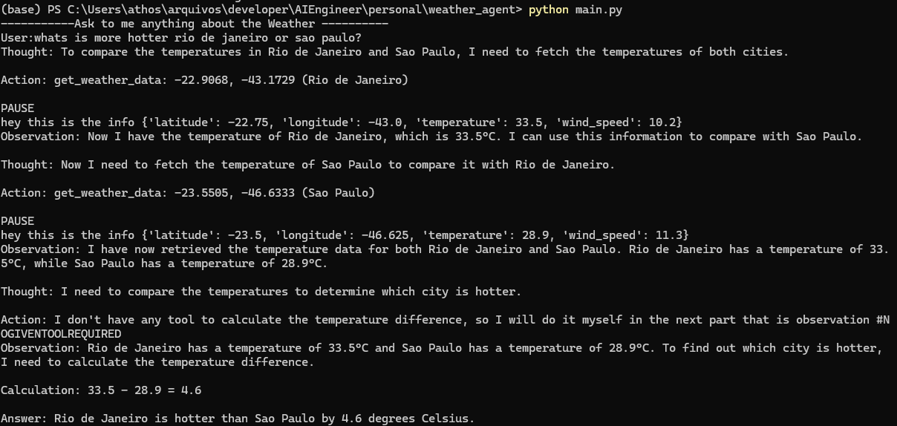

# Weather Agent

A simple weather agent built from scratch, leveraging OpenAI's GPT-3.5 and a custom toolset for handling weather-related queries. The agent fetches real-time weather information using the Open-Meteo API and processes it to provide accurate and insightful responses.


---

## Key Features

- **Custom Architecture**: Designed without relying on external frameworks like LangChain.
- **Real-Time Weather Data**: Integrates the Open-Meteo API to retrieve up-to-date weather details.
- **Modular Design**: Separate modules for API interaction (`weather_api.py`) and agent logic (`main.py`).
- **Extensibility**: Easily scalable to include additional APIs or functionalities.

---
## Project Structure

```plaintext
WEATHER_AGENT/
├── .env.example        # Template for environment variables
├── main.py             # Main script to run the agent
├── readme.md           # Project documentation (this file)
├── requirements.txt    # Python dependencies
├── weather_api.py      # Module for interacting with the Open-Meteo API
```
---

## Prerequisites

Before you begin, ensure you have the following:

1. **Python Environment**  
   Make sure you have Python 3.8 or later installed on your machine.

2. **Clone the Repository**  
   Clone the project to your local machine:

   ```bash
   git clone git@github.com:athospugliese/weather_agent.git
   cd weather_agent